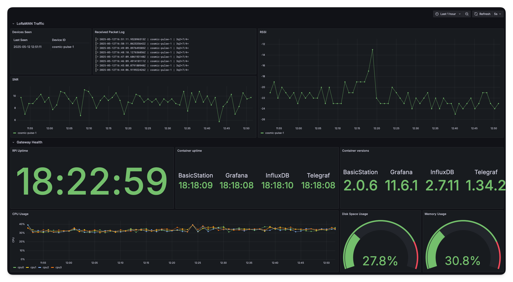

# PiWAN - LoRa Gateway Stack




An all-in-one gateway solution for Raspberry Pi + LoRaWAN using BasicStation and Grafana.

## Table of Contents

- [Project Description](#project-description)
- [Prerequisites](#prerequisites)
- [Installation](#installation)
  - [Cloning on a Raspberry Pi](#cloning-on-a-raspberry-pi)
  - [Configuring the Gateway](#configuring-the-gateway)
- [Usage](#usage)
- [Contributing](#contributing)
- [License](#license)

## Project Description

This project provides a complete LoRaWAN gateway solution that runs on a Raspberry Pi. It includes configuration for BasicStation for LoRaWAN connectivity, integration with Telegraf via TTN MQTT, and Grafana for monitoring. The solution simplifies the deployment of LoRaWAN gateways on edge devices by packaging all necessary services together.

## Prerequisites

Before you begin, ensure you have the following installed on your Raspberry Pi:

- [Docker](https://docs.docker.com/get-docker/)
- [Docker Compose](https://docs.docker.com/compose/install/)

## Installation

### Cloning on a Raspberry Pi

1. Open a terminal on your Raspberry Pi.
2. Clone the repository using Git:
   ```bash
   git clone https://github.com/cosmic-pulse/PiWAN.git
   ```
3. Navigate to the project directory:
   ```bash
   cd PiWAN
   ```

### Configuring the Gateway

1. Rename the `gatewaySAMPLE.conf` to `gateway.conf`.
2. Open the `gateway.conf` file in a text editor:
   ```bash
   nano gateway.conf
   ```
3. Replace the placeholder values with your actual configuration:
   - `YOUR_INFLUXDB_USER`: Your InfluxDB username.
   - `YOUR_INFLUXDB_PASSWORD`: Your InfluxDB password.
   - `YOUR_ORGANIZATION_NAME`: Your InfluxDB organization name.
   - `CHOOSE_A_TOKEN`: Generate an InfluxDB admin token.
   - `YOUR_TTN_APP_ID`: Your TTN application ID.
   - `YOUR_TTN_API_KEY`: Your TTN API key.
   - `YOUR_TTN_REGION`: Your TTN region (e.g., `nam1`).
   - `YOUR_GATEWAY_EUI`: Your gateway's EUI.
   - `YOUR_GATEWAY_API_KEY`: Your gateway's API key.

   Save and exit the file.

4. Find the docker group of your RPi/host:
   ```bash
   getent group docker
   ```
   
5. Modify the `docker-compose.yml` file to set the correct group ID for the `Telegraf` service. Replace `999:0` with the actual group ID you found in the previous step:
   ```yaml
   telegraf:
     container_name: Telegraf
     user: "999:<your_group_id>"
   ```
6. Build and start the Docker containers:
   ```bash
   docker-compose up --build -d
   ```

## Usage
- To start the gateway, run:
  ```bash
  docker-compose up -d
  ```
- To stop the gateway, run:
  ```bash
    docker-compose down
    ```
- To view logs for the BasicStation container, run:
  ```bash
  docker-compose logs -f basicstation
  ```
Once the containers are running, the gateway will connect to the LoRaWAN network and start forwarding data. You can monitor the gateway's performance and metrics using Grafana.
Open your web browser and navigate to `http://<your-raspberry-pi-ip>:3000`.


## Troubleshooting & Common Issues
 ### 1. Grafana complains about folder access permissions:
Set the folder permissions for Grafana before starting the containers:
```bash
cd PiWAN
sudo chown -R 472:472 ./grafana
```

## Contributing

Contributions are welcome! Please fork the repository and submit a pull request with your changes.

## License

This project is licensed under the MIT License.  
For further details, please see the [LICENSE](./LICENSE) file.